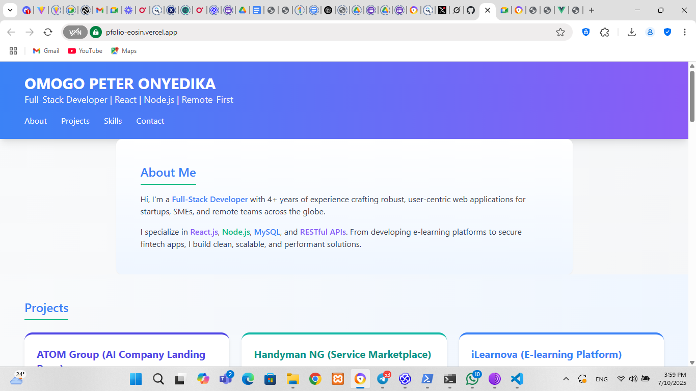

 Omogo Peter Onyedika - Professional Portfolio



## 🚀 Overview

+This repository contains the source code for my professional portfolio website, showcasing my skills, projects, and experience as a Full-Stack Developer. The portfolio is designed to highlight my technical expertise, project accomplishments, and professional journey in web development.
+
+## ✨ Features
+
+- **Responsive Design**: Fully responsive layout that works seamlessly across desktop, tablet, and mobile devices
+- **Modern UI**: Clean, professional interface with smooth animations and transitions
+- **Project Showcase**: Detailed presentations of my most significant projects with descriptions and live links
+- **Skills Section**: Comprehensive overview of my technical skills organized by category
+- **Contact Information**: Easy access to my professional contact details and social profiles
+
+## 🛠️ Technologies Used
+
+- **HTML5**: Semantic markup for improved accessibility and SEO
+- **Tailwind CSS**: Utility-first CSS framework for rapid UI development
+- **JavaScript**: Enhanced interactivity and user experience
+- **Responsive Design**: Media queries and flexible layouts for all device sizes
+- **GitHub Pages**: Hosting platform for the live portfolio
+
+## 📂 Project Structure
+
+```
+portfolio/
+├── index.html              # Main HTML file
+├── img/                    # Project images and assets
+│   ├── atom.png            # ATOM Group project image
+│   ├── Handymann.png       # Handyman NG project image
+│   ├── ilearnova.png       # iLearnova project image
+│   └── ...                 # Other project images
+├── Document/               # Resume and other documents
+│   └── Peter Omogo Resume.pdf  # PDF version of my resume
+└── README.md               # Project documentation
+```
+
+## 🔍 Featured Projects
+
+1. **ATOM Group (AI Company Landing Page)**
+   - Modern, responsive landing page for an AI technology company
+   - Animated elements, service showcases, and product highlights
+   - [View Live](https://atom-landing-five.vercel.app/)
+
+2. **Handyman NG (Service Marketplace)**
+   - Frontend for a service marketplace connecting professionals with clients
+   - Responsive UI with service categories, provider profiles, and booking system
+   - [View Live](https://handymanng.com)
+
+3. **iLearnova (E-learning Platform)**
+   - Led development team for an e-learning platform serving 500+ users
+   - Designed REST APIs and optimized frontend for 40% faster load times
+   - [View Live](https://ilearnovafrontend.vercel.app.com)
+
+4. **Additional Projects**
+   - Selfany (UI Development)
+   - Pension App (Fintech Platform)
+   - Placebet (Betting Platform)
+   - SSABHI (NGO Platform)
+
+## 🚀 Getting Started
+
+### Prerequisites
+
+- A modern web browser (Chrome, Firefox, Safari, Edge)
+
+### Local Development
+
+1. Clone the repository:
+   ```bash
+   git clone https://github.com/onyedika-glitch/portfolio.git
+   ```
+
+2. Navigate to the project directory:
+   ```bash
+   cd portfolio
+   ```
+
+3. Open `OmogoPeter.html` in your browser or use a local development server:
+   ```bash
+   # Using Python's built-in server
+   python -m http.server
+   # Or with Node.js
+   npx serve
+   ```
+
+## 📝 License
+
+This project is licensed under the MIT License - see the [LICENSE](LICENSE) file for details.
+
+## 📞 Contact
+
+- **Email**: [omogopeter48@gmail.com](mailto:omogopeter48@gmail.com)
+- **Twitter**: [ x.com/PeterOmogo2/]( https://x.com/PeterOmogo2/)
+- **GitHub**: [github.com/onyedika-glitch](https://github.com/onyedika-glitch)
+
+---
+
+© 2025 Omogo Peter Onyedika. All rights reserved.
